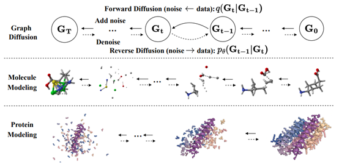

# Generative Diffusion Models on Graphs: Methods and Applications
> 
> Welcome to the [**Generative Diffusion Models on Graphs: Methods and Applications**](https://arxiv.org/abs/2302.02591) repository! 
> This repository serves as a comprehensive collection of resources related to diffusion models applied to graphs. 
>

## Table of Contents
- [Generative Diffusion Models on Graph](#Generative-Diffusion-Models-on-Graph)
  - [SMLD on Graphs](#SMLD-on-Graphs)
  - [DDPM on Graphs](#DDPM-on-Graphs)
  - [SGM on Graphs](#SGM-on-Graphs)
- [Diffusion Models on Graphs: Applications](#Diffusion-Models-on-Graphs:-Applications)
  - [Molecule Modeling](#Molecule-Modeling)
    - [Molecule Conformation Generation](#Molecule-Conformation-Generation)
      - [SMLD](#SMLD1) 
    - [Molecular Docking](#Molecule-Docking)
  - [Protein Modeling](#Protein-Modeling)
    - [Protein Generation](#Protein-Generation)
    - [Protein-ligand Complex Structure Predictiong](#Protein-ligand-Complex-Structure-Predictiong)

## Diffusion models on molecular and protein generations



## Generative Diffusion Models on Graph

### SMLD on Graphs

**Permutation Invariant Graph Generation via Score-Based Generative Modeling** \
*Chenhao Niu, Yang Song, Jiaming Song, Shengjia Zhao, Aditya Grover, Stefano Ermon* \
AISTATS 2021. [[Paper](https://arxiv.org/abs/2003.00638)] [[Github](https://github.com/ermongroup/GraphScoreMatching)] \
2 Mar 2020

**Learning gradient fields for molecular conformation generation** \
*Chence Shi, Shitong Luo, Minkai Xu, Jian Tang* \
ICML 2021. [[Paper](https://arxiv.org/abs/2105.03902)] [[Github](https://github.com/DeepGraphLearning/ConfGF)] \
9 May 2021

### DDPM on Graphs

**Diffusion Models for Graphs Benefit From Discrete State Spaces** \
*Kilian Konstantin Haefeli, Karolis Martinkus, Nathanaël Perraudin, Roger Wattenhofer* \
LoG 2022 and NeurIPS GLFrontiers 2022. [[Paper](https://arxiv.org/abs/2210.01549)] [[Github](https://github.com/kilian888/discrete_dppm_graphs)] \
4 Oct 2022

**DiGress: Discrete Denoising diffusion for graph generation** \
*Clement Vignac<sup>1</sup>, Igor Krawczuk<sup>1</sup>, Antoine Siraudin, Bohan Wang, Volkan Cevher, Pascal Frossard* \
ICLR 2023. [[Paper](https://arxiv.org/abs/2209.14734)] [[Github](https://github.com/cvignac/digress)] \
29 Sep 2022

### SGM on Graphs

**GraphGDP: Generative Diffusion Processes for Permutation Invariant Graph Generation** \
*Han Huang, Leilei Sun, Bowen Du, Yanjie Fu, Weifeng Lv* \
IEEE ICDM 2022. [[Paper](https://arxiv.org/abs/2212.01842)] [[Github](https://github.com/graph-0/graphgdp)] \
4 Dec 2022

**Score-based Generative Modeling of Graphs via the System of Stochastic Differential Equations** \
*Jaehyeong Jo, Seul Lee, Sung Ju Hwang* \
ICML, 2022.  [[Paper](https://arxiv.org/abs/2202.02514)] [[Github](https://github.com/harryjo97/gdss)] \
5 Feb 2022

**Fast Graph Generative Model via Spectral Diffusion** \
*Tianze Luo, Zhanfeng Mo, Sinno Jialin Pan* \
arXiv 2022. [[Paper](https://arxiv.org/abs/2211.08892)] \
16 Nov 2022

**Score-based graph generative modeling with self-guided latent diffusion** \
*Ling Yang, Zhilong Zhang, Wentao Zhang, and Shenda Hong* \
OpenReview. [[Paper](https://openreview.net/forum?id=AykEgQNPJEK)] \
02 Feb 2023

## Diffusion Models on Graphs: Applications

### Molecule Modeling

#### Molecule Conformation Generation

#### <span id='SMLD1'></span>SMLD

**MDM: Molecular Diffusion Model for 3D Molecule Generation** \
*Lei Huang, Hengtong Zhang, Tingyang Xu, Ka-Chun Wong* \
Submitted to AAAI'23. [[Paper](https://arxiv.org/abs/2209.05710)] \
13 Sep 2022


#### Molecular Docking

###  Molecule Modeling

#### Protein Generation

#### Protein-ligand Complex Structure Predictiong

> If you find our survey useful for your research, please cite the following paper:
```
@article{fan2023generative,
  title={Generative diffusion models on graphs: Methods and applications},
  author={Fan, Wenqi and Liu, Chengyi and Liu, Yunqing and Li, Jiatong and Li, Hang and Liu, Hui and Tang, Jiliang and Li, Qing},
  journal={arXiv preprint arXiv:2302.02591},
  year={2023}
}
```
